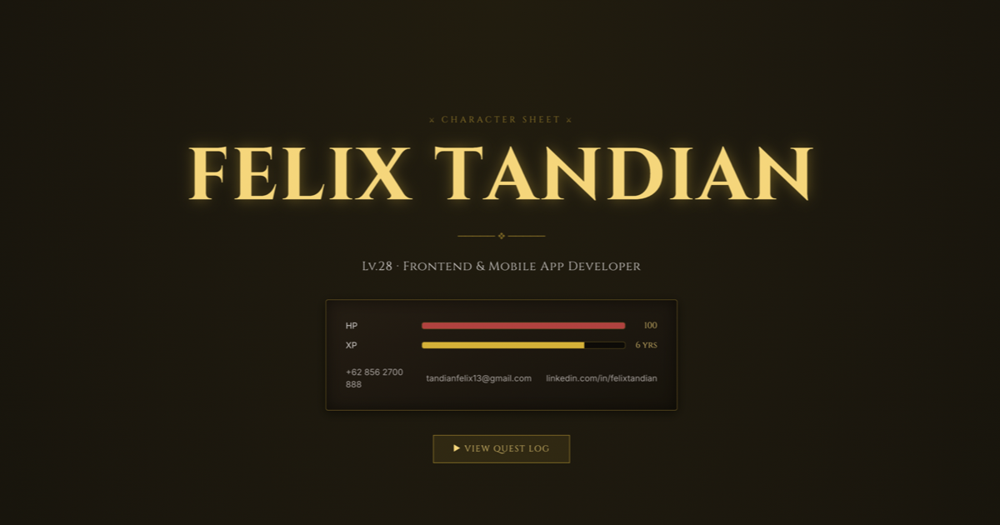

# ⚔ Felix Tandian — Character Sheet

> An interactive RPG-themed portfolio. Not a resume — a **character sheet**.

Every developer has a story. Mine is told the way I'd want to read it: as a quest log. Six years of adventuring through Flutter, Dart, and full-stack development, rendered as a dark-fantasy character sheet with animated stat bars, quest entries, and a torch-lit UI.

**Lv.28 · Frontend & Mobile App Developer · Jakarta, ID**



---

## 🗺 What's Inside

| Screen | What it shows |
|---|---|
| **Character Sheet** | Name, class, HP/XP bars, and how to reach me |
| **Stats & Abilities** | Skill levels as animated stat bars — Flutter, Dart, Java, SQL, Firebase & more |
| **Quest Log** | Work experience as main quests, side quests, and the tutorial level |
| **Training Grounds** | Education at Bina Nusantara + abilities learned along the way |

## ⚙ Tech Loadout

- **[Next.js 15](https://nextjs.org)** (App Router) — the engine
- **[Tailwind CSS v4](https://tailwindcss.com)** — CSS-first `@theme` config, no config file
- **[Framer Motion](https://motion.dev)** — scroll-triggered quest reveals, spring-loaded stat bars
- **[Cinzel](https://fonts.google.com/specimen/Cinzel) + Inter** via `next/font` — fantasy display, legible body
- **TypeScript** — because even wizards type-check their spells

## 🎮 Run It Locally

```bash
git clone https://github.com/felixtandian/felix-cv.git
cd felix-cv
npm install
npm run dev
```

Open [http://localhost:3000](http://localhost:3000) and press start.

## 🏰 Project Structure

```
app/
  layout.tsx        # fonts + metadata
  page.tsx          # assembles the sheet
  globals.css       # RPG theme: palette, panels, torch flicker
components/
  Hero.tsx          # character sheet header
  Skills.tsx        # stats & abilities
  Experience.tsx    # quest log
  Education.tsx     # training grounds
  StatBar.tsx       # animated skill bar
  Section.tsx       # scroll-reveal section wrapper
  motion.ts         # shared Framer Motion variants
```

## 📫 Send a Raven

- **Email:** [tandianfelix13@gmail.com](mailto:tandianfelix13@gmail.com)
- **LinkedIn:** [linkedin.com/in/felixtandian](https://linkedin.com/in/felixtandian)
- **Phone:** +62 856 2700 888

---

*© 2026 Felix Tandian — the journey continues…*
